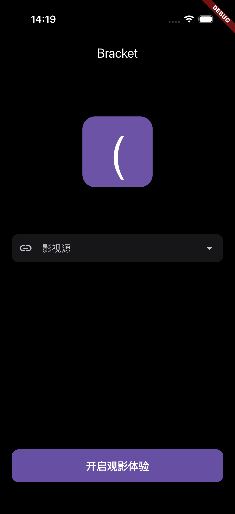
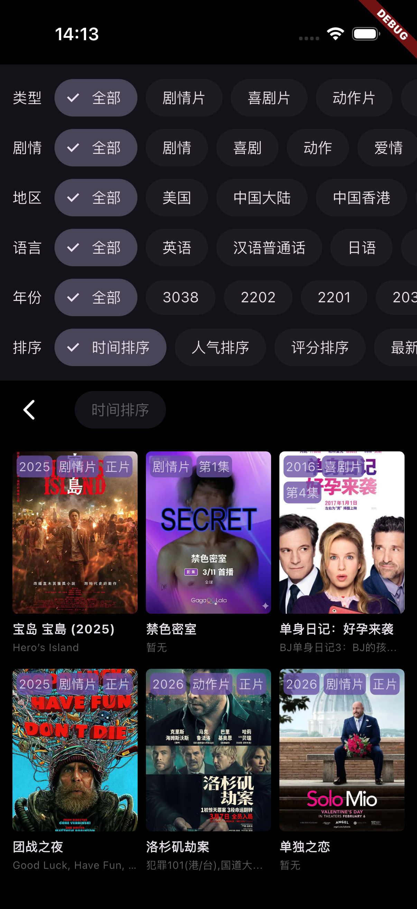
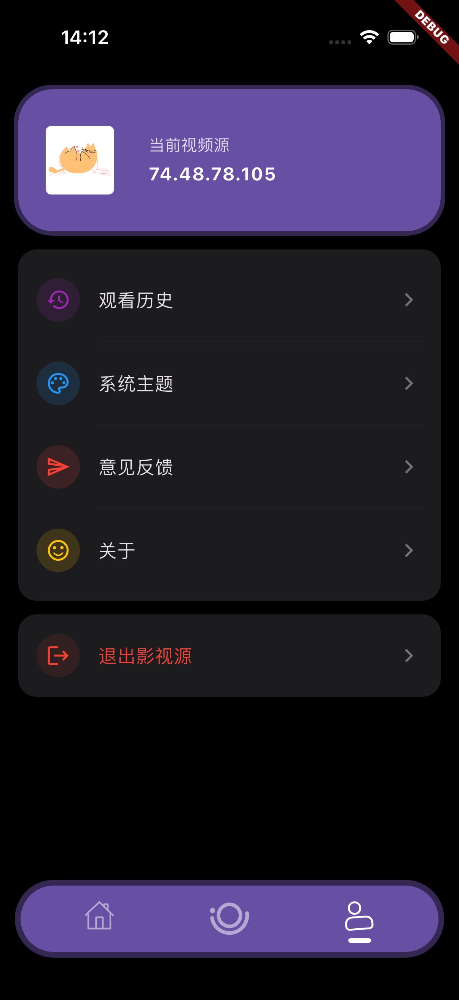

# 🎬 EcoTV

**一款基于 Flutter 构建的极致免费观影体验 App**

> A professional video streaming application built with Flutter, focused on simplicity and performance.

[](https://dart.dev)
[](https://flutter.dev)
[](https://fvm.app)
[](LICENSE)
[](https://github.com/fe-spark/Eco-TV/actions)

---

## ✨ 项目特色 | Features

- 🚀 **极致流畅**：基于 Flutter 渲染引擎，提供原生级别的交互体验。
- 📱 **跨端支持**：完美支持 Android 与 iOS (越狱/自签)。
- 🎨 **简约设计**：现代化的 UI 设计，支持海报墙展示。
- 📄 **数据灵活**：通过 [EcoHub](https://github.com/fe-spark/EcoHub) 接入，支持自定义视频源。
- 📺 **投屏支持**：支持 iOS AirPlay 与 Android DLNA 投屏。
- 🤖 **自动化构建**：全流程 GitHub Actions 自动化打包释放。

---

## 🏗️ 快速开始 | Getting Started

### 环境要求

- Flutter SDK `3.38.5` (建议使用 [FVM](https://fvm.app) 管理)
- Dart SDK：使用 Flutter `3.38.5` 自带版本

### FVM 使用说明

本项目通过 [`.fvmrc`](./.fvmrc) 固定 Flutter 版本为 `3.38.5`。

首次进入项目可按以下步骤准备环境：

```bash
# 安装 FVM (macOS / Homebrew)
brew install fvm

# 进入项目
cd Eco-TV

# 安装并绑定项目要求的 Flutter 版本
fvm install
fvm use
```

后续在项目目录内统一使用以下命令：

```bash
fvm flutter pub get
fvm dart run build_runner build --delete-conflicting-outputs
fvm flutter run
fvm flutter analyze
```

### 运行步骤

```bash
# 获取依赖
fvm flutter pub get

# 生成代码 (JsonSerializable)
fvm dart run build_runner build --delete-conflicting-outputs

# 运行项目
fvm flutter run
```

---

## 🛠️ 构建与编译 | Build

### Android

```bash
fvm flutter build apk --release
```

### iOS (Unsigned)

```bash
fvm flutter build ios --release --no-codesign
```

---

## 👆 播放手势 | Gestures

播放器支持以下常用手势交互：

- 单击：显示或隐藏播放器控制栏
- 双击：播放 / 暂停
- 长按：临时倍速播放，松开后恢复
- 横向滑动：快进 / 快退
- 全屏左侧纵向滑动：调节屏幕亮度
- 全屏右侧纵向滑动：调节系统音量

## 📺 投屏支持 | Casting

- iOS：支持通过 AirPlay 投屏到兼容设备
- Android：支持通过 DLNA 投屏到同一局域网内的电视或盒子
- 当前仅支持可直接访问的 `http/https` 视频地址，部分源可能因格式或设备兼容性限制而无法投屏

## 📸 界面预览 | Preview

|                影视源配置                |                  首页推荐                  |                  搜索页面                  |
| :--------------------------------------: | :----------------------------------------: | :----------------------------------------: |
|  |  |  |

|                  分类浏览                  |                  筛选体验                  |                  播放详情                  |                  个人中心                  |
| :----------------------------------------: | :----------------------------------------: | :----------------------------------------: | :----------------------------------------: |
|  |  |  |  |

---

## 📡 视频源说明 | Data Source

本项目不存储任何视频数据，仅作为视频播放器。

- **默认服务**：[网页版地址](https://eco.fe-spark.cn)
- **API 接口**：`https://eco.fe-spark.cn/api` (由于带宽限制，高峰期可能访问缓慢)。
- **自定义搭建**：如需稳定体验，建议参考 [EcoHub](https://github.com/fe-spark/EcoHub) 自行搭建后端。

---

## ⚖️ 免责声明 | Disclaimer

1. 本项目仅供 **学习交流** 使用，严禁用于任何商业用途。
2. 数据来源均源于网络公开接口，开发者不承担任何资源版权责任。
3. 若您认为本项目侵犯了您的合法权益，请通过邮箱及时联系，我们将尽快处理。

---

> Created with ❤️ by fe-spark
